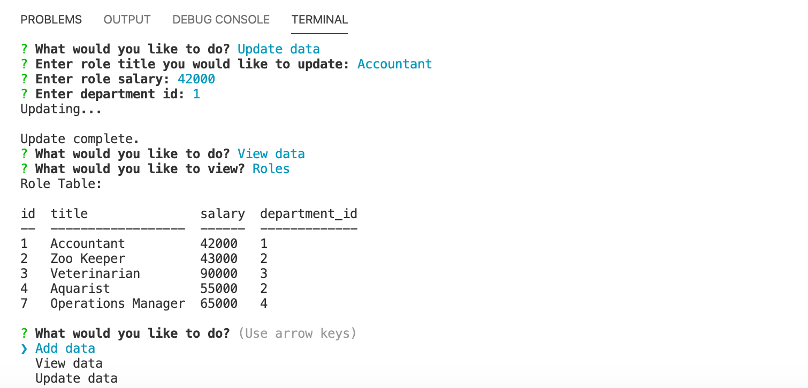

Homework-12: Employee Tracker  

This is an interactive database designed for non-developers to view and interact with information stored in a database. This content management system is built to manage a company's employees using node, inquirer, and MySQL.  

The database schema provided includes employee, role, and department tables. The command-line application allows the user to add data, view data, and update data.  

  

Built with:  
Visual Studio Code  
Javascript  
Node.js  
Express  
MySQL  

Authors:  
Ilana Shaffer  

Acknowledgments:  
University of Denver - Bootcamp Spot Assignment

